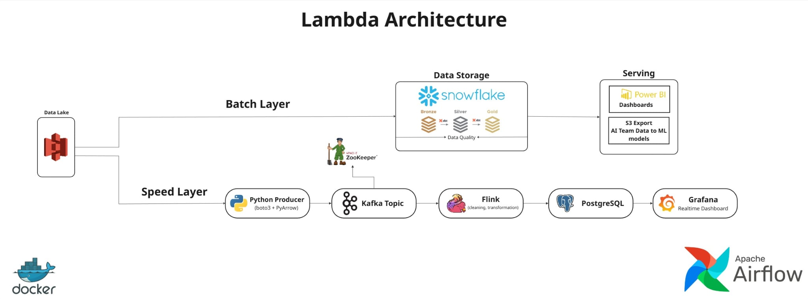

# Smart Ride Analytics System 🚖📊

<p align="center">
	
</p>

This repository demonstrates a Lambda-style architecture to process taxi trip data for both batch and real-time use cases.

The image above is `Project_Architecture.jpg` stored in the repository root; the README uses a repository-relative path so GitHub renders it.

To embed the picture in Markdown, use this snippet:

```markdown
<p align="center">
	
</p>
```

## 1. Batch Layer

**Source:**  
NYC Taxi trip data (large CSV files) originally downloaded from Kaggle and stored locally.

**Ingestion:**  
Because the CSV files are very large, they were first converted into **Parquet** to reduce size.  
The optimized Parquet files were then uploaded into **AWS S3 (Data Lake)**.

**Storage & Modeling:**  
Snowflake is connected to S3 and reads the Parquet files using **Snowpipe / external stages**.  
The batch transformations are managed using **dbt**, which handles:
- Bronze layer (raw staging)
- Silver layer (cleaned & standardized)
- Gold layer (analytics models)

**Visualization:**  
Analytical dashboards are built in **Power BI**, connected directly to Snowflake for reporting & insights.

---

## 2. Streaming Layer

**Source:**  
Real-time trip records simulated using a Python Kafka producer.  
The producer reads Parquet rows (trip by trip) and streams them into a **Kafka topic** (`s3-taxi-trips`).

**Pipeline:**

- The Kafka producer continuously publishes trip events to Kafka  
- Kafka stores incoming streaming messages in the raw topic  
- **Flink** consumes the raw Kafka topic and performs:
  - Cleaning
  - Enrichment
  - Time-window aggregations (e.g., trips per minute, revenue per window)
- Flink outputs the processed results into **PostgreSQL**
  - This acts as the real-time serving database for dashboards
- **Grafana** visualizes:
  - Trips per minute
  - Real-time revenue
  - Processing latency
  - Kafka/Flink pipeline metrics

**Orchestration:**  
Airflow orchestrates and schedules batch + streaming tasks inside the Docker environment under `Streaming/infra`.

---
